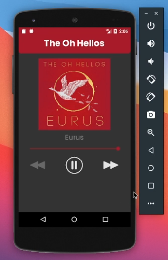
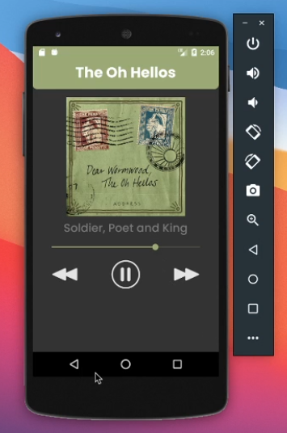
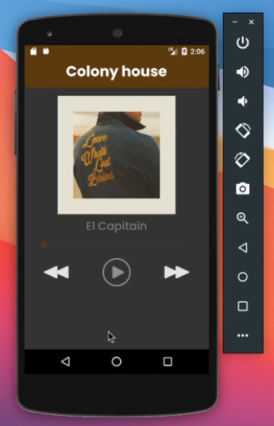
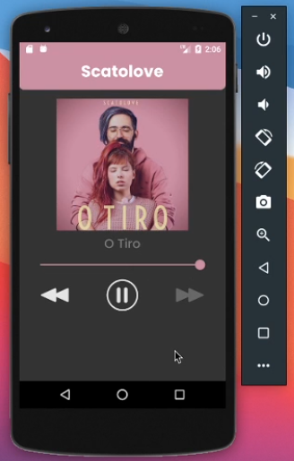

#  &nbsp; Audio player app

#### Audio player app that play songs with android studio with Java. (it's static songs)

 

## What I've learned
* Use media player appropriately
* Use Seek Bar and sync with the media player song
* how to change the color of Status Bar dynamically on the program
* how to change the color of SeekBar dynamically on the program
* how to change the color of imageviw background dynamically on the program

 

___

<h4 align="center">
    💜 by  Vitor Carmo
</h4>

